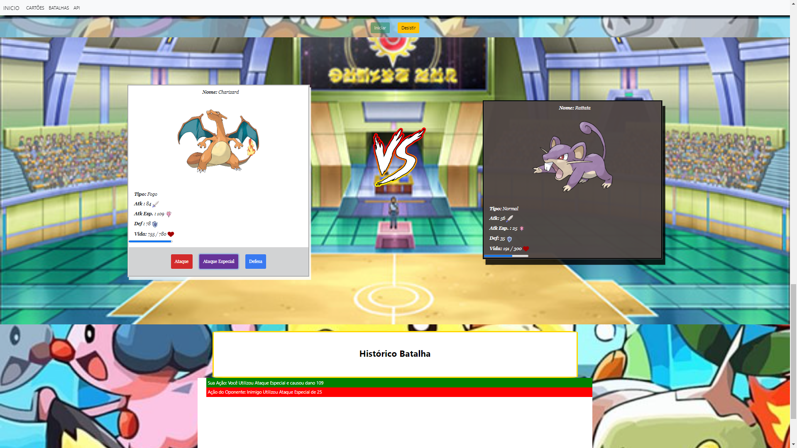
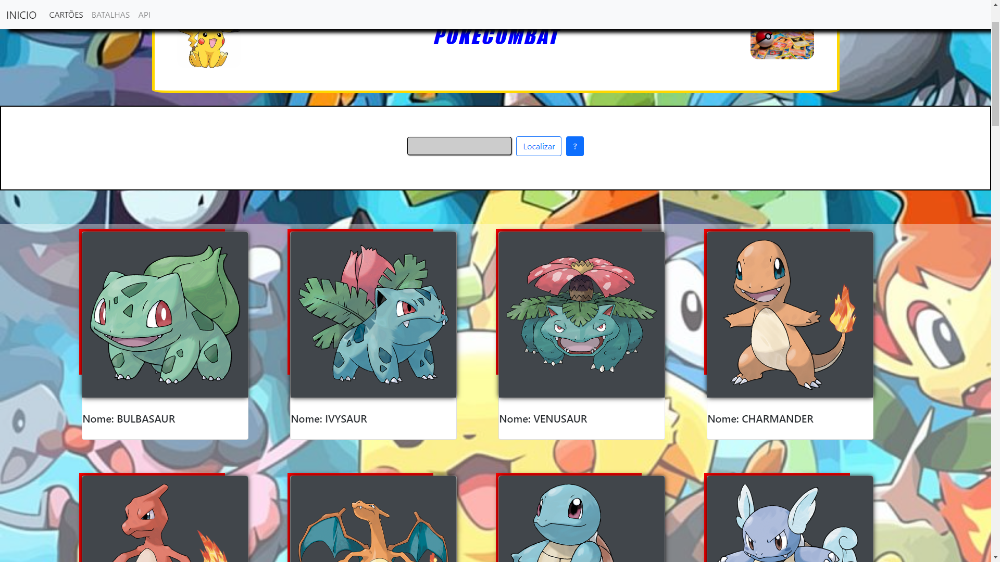

<h1 align="center">POKECOMBAT</h1>

###

<p align="left">Um projeto que integra com a PokeAPI, a famosa API do Pokémon. Desenvolver esse projeto foi uma experiência extremamente gratificante e proporcionou um aprendizado enorme na linguagem JavaScript, permitindo-me aprimorar ainda mais meus conhecimentos.
  
  
  Acredito que muitos desenvolvedores iniciantes começam com essa API, como uma espécie de projeto de entrada no mundo da programação. Este projeto era algo que eu desejava realizar há algum tempo, e ver tudo funcionando é uma grande conquista. Sei que é um projeto de entrada onde posso realizar a refatoração do código e até mesmo fazer upgrades para trazer mais funcionalidades. Mesmo assim, já fico muito feliz com o resultado inicial.</p>

###

<h2 align="left">🛠️ Tecnologias e Recursos</h2>

Linguagem: JavaScript

Banco de Dados: MySQL

API - [PokéAPI](https://pokeapi.co/)


### 📋 Funcionalidades

 - CRUD de Pokémon (Criar, Ler, Atualizar e Deletar)

 - Interação de Batalha (Ataque, Ataque Especial, Defesa) 
 
 - Registro de Resultados
   
 - Busca de Pokémon na API

### 🚀 Como executar
1 - Clone o repositório:

```bash
https://github.com/MatheusReis97/PokeCombat.git
```

2 - Acesse a pasta do PokeCombat :

```bash
cd PokeCombat
```

3 -  Abra o arquivo index.html no navegador ou você pode:

 - Dar dois cliques no arquivo index.html, ou

 - Usar uma extensão como o Live Server no VS Code


###  📸 Imagens do Projeto


<div align="center">
  
</div>

<hr>

<div align="center">
  
</div>

<hr>


### Vai lá conferir e se divirta:

<a href="https://matheusreis97.github.io/PokeCombat/">POKECOMBAT</p></a>

###
